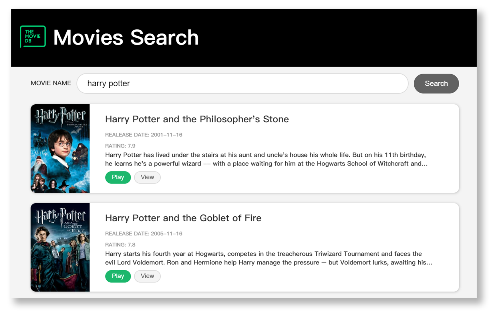

# Movies Search Application

## Introduction

Welcome to the Movie Search Application build with React and The Movie Database (TMDb) API.

:bookmark_tabs: Live Demo is available [**here**]().

## Running the App

This project was bootstrapped with [Create React App](https://github.com/facebook/create-react-app).

In the project directory, you can run: `yarn start`

Runs the app in the development mode. 
Open [http://localhost:3000](http://localhost:3000) to view it in the browser.

## Concepts Covered

- Create an account and request an API key for [The Movie Database (TMDb) API](https://www.themoviedb.org/)
- Manage State with React useState Hook
- Use Props to communicate between parent and child components, relying on the top-down data flow instead of trying to sync the state between different components
- Use controlled components to control the actions that occur on the form during user input, making state the only data source
- Request and display movie data to The Movie Database API via Fetch API
